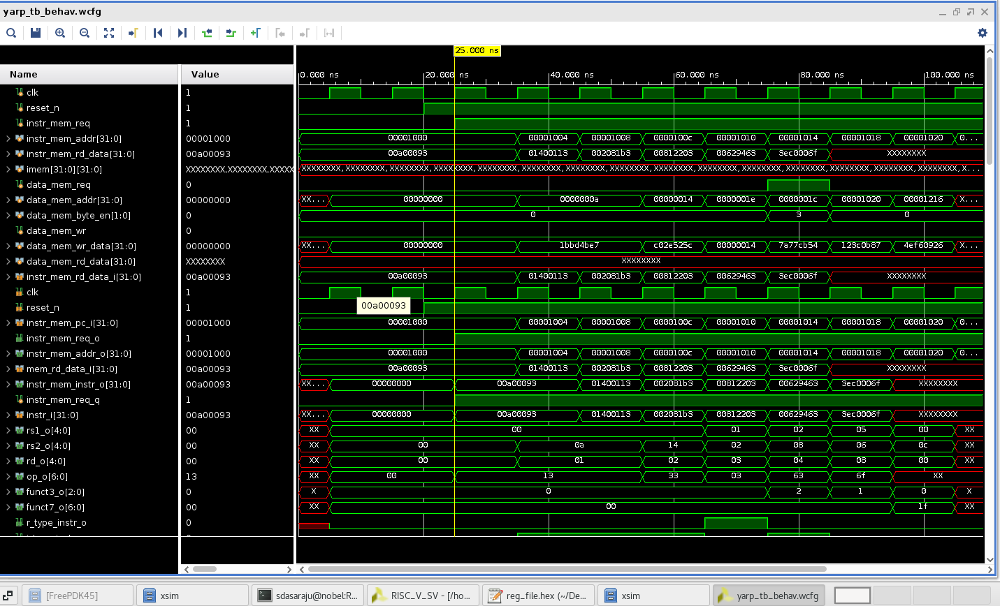
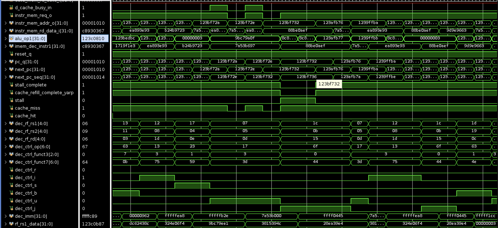

# 🧠 Custom RISC-V Core

This project implements a **RISC-V Core** built completely from scratch using **SystemVerilog**.  
It began as a **Single-Cycle RV32I processor** and has now evolved into a **5-stage pipelined CPU** with an expanding memory hierarchy.  
The design includes core components such as the Instruction Memory, Decode Unit, Register File, Execute Unit, Data Memory, Control Unit, Branch Control Unit, and Program Counter Register.  
A **direct-mapped instruction cache and data cache** have also been implemented as part of the memory subsystem.

---

## 🏗️ Core Architecture Diagram

Below is the complete architectural block diagram of the RISC-V processor, including the Instruction Cache, Data Cache, and CPU pipeline structure:

---

## 🚀 Overview

The RISC-V core initially followed a **single-cycle architecture**, where each instruction executes in a single clock cycle.  
It has now been extended into a **5-stage pipelined architecture** (IF → ID → EX → MEM → WB), enabling higher frequency operation and better system performance.

### **Core Components**

- **Instruction Memory**
- **Decode Unit**
- **Register File** – 32 registers (x0–x31)
- **ALU / Execute Unit**
- **Data Memory**
- **Control Unit**
- **Branch Control Unit**
- **Pipeline Registers**
- **Direct-Mapped Instruction Cache**
- **Direct-Mapped Data Cache**
- **Program Counter Register**

---

## ✅ Current Progress

✔️ **Baseline Single-Cycle Core**  
Fully functional RV32I single-cycle processor supporting all base instructions.

✔️ **Functional Verification**  
Validated using real RISC-V assembly programs converted to HEX files via the official RISC-V toolchain.  
Waveforms analyzed in Xilinx Vivado confirm correct execution of all instructions.

✔️ **Synthesis & Timing Analysis**  
- Developed a custom TCL script for automated synthesis and latch detection (none detected).  
- Pipelined version: **3.47 ns** slowest arrival time.  
- Single-cycle version: **1.73 ns**, but includes unrealistic reg-to-reg paths due to single-cycle timing constraints.

✔️ **Extended to 5-Stage Pipelined CPU**  
Successfully implemented all pipeline stages (IF, ID, EX, MEM, WB) with modular pipeline registers.

✔️ **Direct-Mapped Instruction Cache**  
Integrated between the CPU and instruction memory to reduce fetch latency and support future memory hierarchies.

✔️ **Designed and Integrated the Data Cache**  
Implemented a direct-mapped data cache with support for both read and write operations.  
Designed the cache using a write-through and no-write-allocate policy.

✔️ **Full Memory Subsystem Integration**  
Instruction cache, data cache, and both instruction and data memory, all integrated into a subsystem connected to the core.

✔️ **Verification with Python-Generated Custom Tests**  
Developed a Python script generating random and directed RISC-V instruction sequences to thoroughly test pipeline and cache behavior.

✔️ **Pipeline Stall Logic Implemented (Cache Busy Handling)**  
Added cache-aware stall logic:  
- Pipeline freezes when data cache is busy or on a cache miss.  
- Ensures correct execution ordering between MEM and WB stages.

---

## 🧩 Next Steps

🔄 **Complete Timing Analysis of Core + Caches**  
- Analyzed timing across cached and non-cached versions to quantify the effect of memory hierarchy on critical paths.
  
🔄 **Hazard Handling**
- Forwarding/bypass logic  
- Hazard detection unit  
- Resolving data & control hazards

📈 **Performance Measurement**
- IPC measurement  
- Hit/miss rate tracking  
- Memory latency impact  
- Max frequency comparison between cached & non-cached systems
---

## 📊 Output Waveform

!

---

## 🧰 Tools & Technologies

| Category         | Tools Used                       |
| ---------------- | -------------------------------- |
| **HDL**          | SystemVerilog                    |
| **Simulation**   | Xilinx Vivado                    |
| **Synthesis**    | Synopsys Design Compiler         |
| **ISA**          | RISC-V (RV32I)                   |
| **Verification** | Assembly → HEX toolchain, Python |

---
